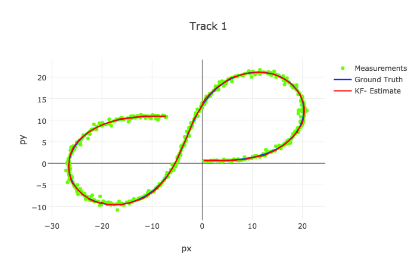

# Extended Kalman Filter in C++

The goal of this project was to implement an Extended Kalman Filter in C++, using noisy LIDAR and RADAR measurements, to track an object's position and velocity. Udacity provided starter code, which can be found in the repository from which I forked this one. 

To run my code, clone this repo and see the instructions in "project_assignment.md". All the necessary code is in the "src" folder.

The input data from LIDAR and RADAR measurements can be found in "data/obj_pose-laser-radar-synthetic-input.txt". My results for track one and two can be found in "data/obj_pose-laser-radar-ekf-output.txt" and "data/obj_pose-laser-radar-ekf-output2.txt," respectively. 

Below for both tracks, I have plotted the measurements from both sensors in green, the ground truth position and velocity in blue, and the Kalman Filter's estimates in red. As you can see from the plots and the Root-Mean-Squared Error below the plots, the Kalman Filter does a good job of tracking moving objects. 

 <figure>
  
</figure>
 

RMSE: 
X: 0.0973, Y: 0.0855, VX: 0.4513, VY: 0.4399

 <figure>
  
</figure>
 

RMSE: 
X: 0.0726, Y: 0.0967 , VX: 0.4579, VY: 0.4966
